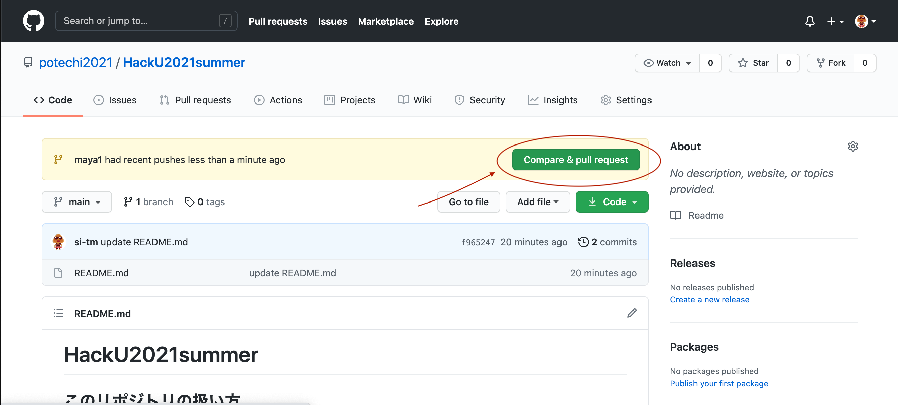
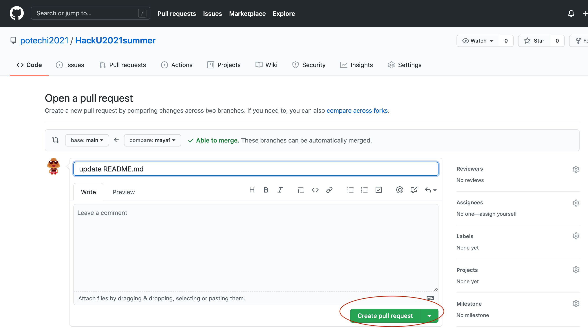
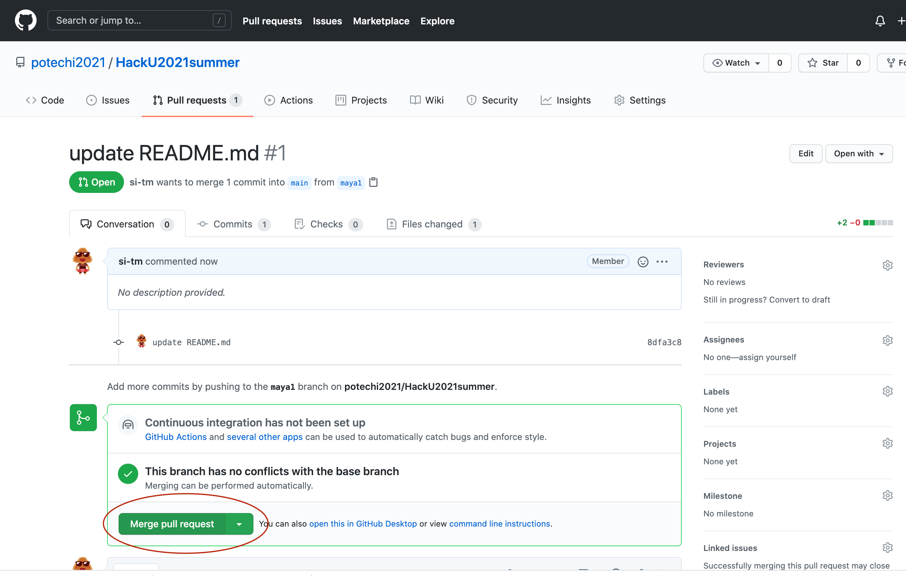
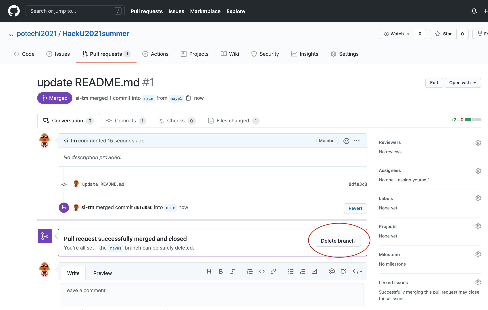

# HackU2021summer

## このリポジトリの扱い方

### 初めに

- ターミナルで以下の操作を行う
- 空のディレクトリで``` git clone https://github.com/potechi2021/HackU2021summer ```を打ち、Enterをおす
- HackU2021summer/が作成される
- ```cd HackU2021summer/``` で移動
- ``` git branch <自分のブランチ名(なんでも大丈夫！)> ``` を打ち、Enterをおす (自分のブランチを作る)
- ``` git checkout <自分のブランチ名(なんでも大丈夫！)> ``` を打ち、Enterをおす (自分のブランチへ移動)
- ``` git branch ``` を打ち、Enterを押すと以下のようになるのを確認する
```$ git branch ```
```* <自分のブランチ名> ```
```  main ```
  
### ファイルを変更する時

- ターミナルで以下の操作を行う
- ``` git pull origin main``` 
- ``` git branch ``` と打ち、自分のブランチにいることを確認する 
- mainにいる場合は、``` git checkout <自分のブランチ名> ```で移動する
- ファイルに変更を加える
- ``` git add <変更したファイル名> ``` を打つ
- ``` git commit -m "変更した点" ``` を打つ
- ``` git push origin <自分のブランチ名> ```を打つ → [ここへ移動](https://github.com/potechi2021/HackU2021summer/ "ここ")
- のちに記入

- 
- 
- 
- 

- ターミナルに戻る
- ``` git checkout main ``` でmainに戻る
- ``` git pull origin main ``` でリモートブランチとバージョンを一致させる
- ``` git branch ``` で今いるブランチを確認
- ``` git branch -D <消すブランチ名>``` でブランチを削除
- ``` git branch <自分のブランチ名>``` でブランチを作成
- ``` git checkout <自分のブランチ名>``` でブランチを移動

### ちょくちょくやって欲しいこと

- ``` git pull origin main ``` 
- ``` git fetch ``` 
- のちに記入
